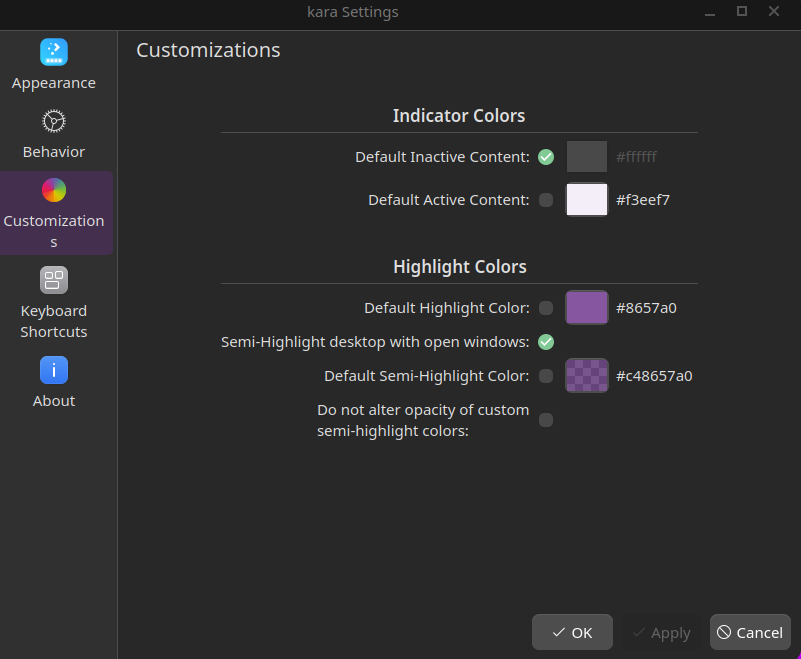
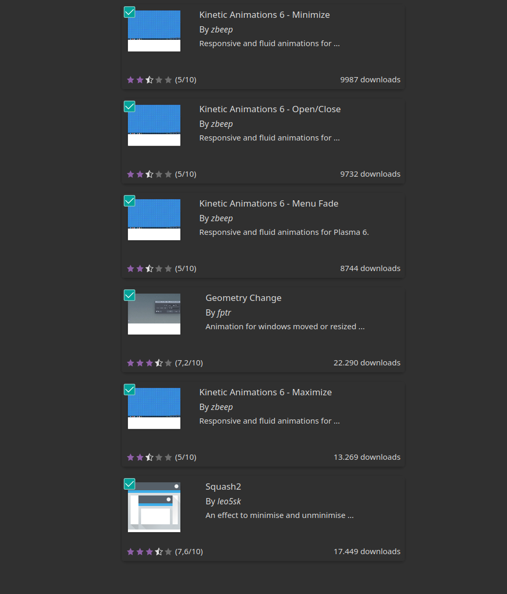

# KDE Customization by Frank

I am a huge fan of the cyberpunk and post-apocalyptic genres, so I wanted to give my system a touch of that style. Since I feel more comfortable with the Windows/Deepin-style bottom bar, I chose to configure it that way, as I find the MacOS style in ultrawide mode not very intuitive.

With this customization, your desktop will look like this:

The KDE customizations I usually see on Unixporn tend to have a lot of blur, and I don't hate blur, but too much of it causes me a lot of eye strain. That's why I've tried to make the bar and plasmoids look nice, but keep the rest of the windows in flat dark tones so as not to damage my eyesight.

## 1. Theme installation
First theme to install is from vinceliuice.

~~~
https://github.com/vinceliuice/Fluent-kde.git
~~~

When you clone, install with this command:

~~~
./install.sh -t purple --round --solid
~~~

Now, install Darkly for a modern style. I follow fedora instructions, but in their repository, you have all the ways to install it.

~~~
https://github.com/Bali10050/Darkly
~~~

Install Orchis theme, I install it from vinceliuice repo too.

~~~
https://github.com/vinceliuice/Orchis-kde
~~~

The icon pack is downloaded from 'Get-New' in the System settings.
**Reversal-purple-dark**

Cursors are installed when you install the theme from repo, but if you dont have it, you could install in 'Get-New'. Its called Vimix Cursors

My system sounds are downloaded from here:
~~~
https://store.kde.org/p/2134858
~~~
After you download, extract it and rename to harmony and move it to the system sound folder.
~~~
sudo mv harmony /usr/share/sounds
~~~

In Konsole app I download the Orchis color scheme.

Finally install a SDDM theme like Orchis.

## 2. Time to config!

In the colors section, select FluentDark and at the top select a purple/violet accent color.

On Application Style, select Darkly previusly installed and config as you wish.

Plasma Style: Select Orchis-dark

Window Decorations: Orchis-dark-solid

Icons: Reversal-purple-dark

Cursors: Vimix Cursors

System Sounds: Harmony 2

No splash screen

SDDM: Orchis

## 3. Change fonts

In my setup I usually install a lot of Nerd fonts, but for system I download Work Sans.

I use in system font Work Sans and in Fixed font and mono, Hack Nerd font

## 4. Change the wallpaper to one of mine.

I'll leave them in my Wallpapers repository folder. Select as you wish.

## 5. Panels and plasmoids
I setup a empty panel on the bot, float mode, Fill width, always show, put translucent always and 58 size.

The plasmoids that I use is a combination of default and downloaded from 'Get-New'. The default plugins ill mark as "Default".

The plugins I use in the bar from left to right are:

- Default - Margin separator
- Kara for virtual Desktop
- Default - Margin separator
- Latte separator
- Default - Margin separator
- PlasMusic Toolbar
- Default - Panel Spacer
- Andromeda launcher
- Default - Margin separator
- Latte separator
- Default - Margin separator
- Default - Icon only taskbar
- Default - Panel Spacer
- Default - System tray
- Default - Margin separator
- Latte separator
- Default - Margin separator
- Default - Folder view
- Default - Margin separator
- Default - Notification applet.
- Default - Margin separator
- Default - Digital Clock
- Default - Margin separator
- Default - Minimize all windows
- Default - Margin separator
- Shutdown or switch

In the Kara settings I setup 4px spacing, 54px fixed lenght, Highlight with Square and the custom icons:

~~~
globe
format-text-code
music-note-16th
presence_unknown
joystick
~~~

PlasMusic Toolbar I design so that it has an organic shape alongside the system

Andromeda launcher is setting up at the same method, that it has a similar appearance to Windows 11.

Disable some system tray icons and set large padding.

Folder view to the download folder.

## 6. KWin scripts & Desktop effects
I install this KWin scrips, animations and desktop effects.

Animations:

Desktop Effects:
https://github.com/matinlotfali/KDE-Rounded-Corners

Center new windows & KZones

In the Desktop Effects setup I enable Rounded Corners, Geometry change and Fading popups(Kinetic)

In Rounded Corners I disable all outline activated effects and in Shadow tab if you find any bottom shadow glich you can enable Custom Shadows and set Active shadow to 40 and inactive Shadow to 20.

On KWin Scripts I enable Center new windows.

At the Animations Tab in system settings you can select Kinetic animations and done!

## 7. Setup Konsole
I use Orchis color schema for it and let the starship config into dotfiles folder.

Im not very expert on starship prompt, im testing in this case and I use catppuccin base so if you have another suggestion that looks better with my setup, send a PR so I can take a look at it, and if I like it, I'll change it and incorporate it.

### Now we have a beautiful setup and clean cyberpunk!!
